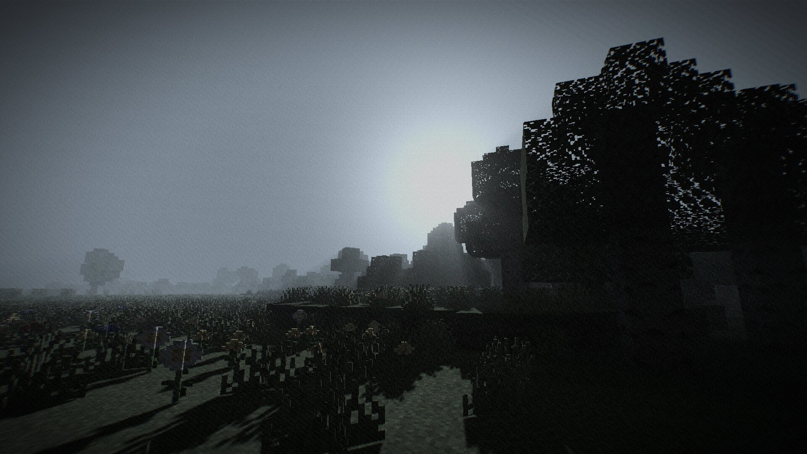
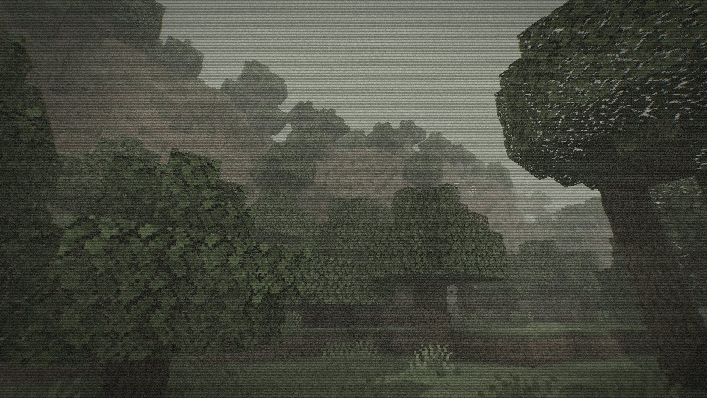
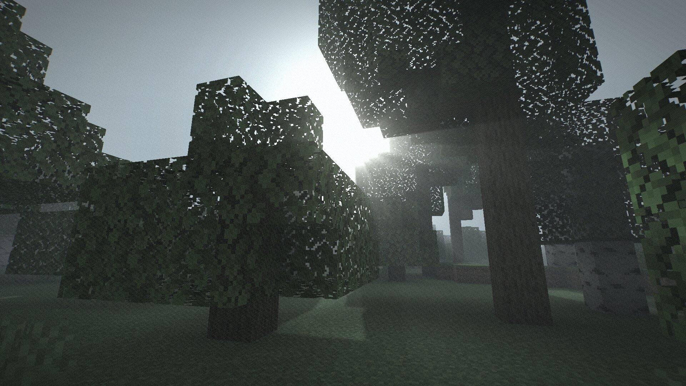
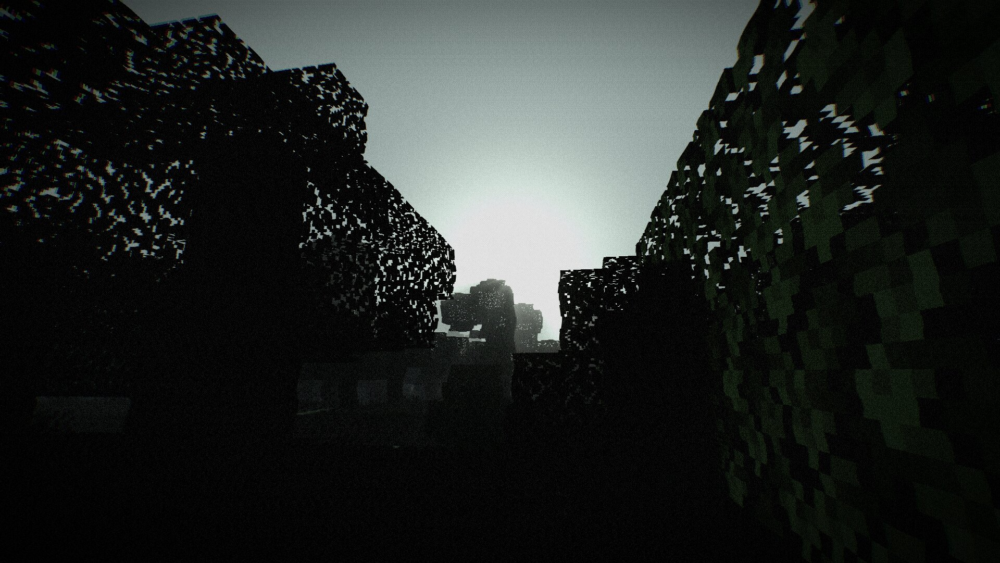

# Lost Tape Shader

An analog-horror shaderpack for Iris and Oculus. Dense breathing fog swallows the horizon, real shadow-mapped shadows crawl across the terrain, and volumetric light shafts cut through the haze, all wrapped in VHS grain, dithering and PSX-era vertex wobble.

It is built on the classic fixed-function pipeline (GLSL 120) rather than a heavy PBR setup, so it runs fast even on weak GPUs while still hitting that Somber-style found-footage look.

## Features

- **Breathing fog**: dense exponential fog that slowly swells and recedes, with adjustable start distance and sky swallowing
- **Real shadows**: distortion-mapped shadow maps including entities, with adjustable strength, softness (hard, PCF soft, very soft), resolution, distance and sun path tilt
- **Volumetric light shafts**: god rays marched through the shadow map. Fog darkens inside shadow columns, so bright streaks run along shadow edges
- **Contact shadows (SSAO)**: objects cast soft screen-space shadows in corners and around block light, so torches produce visible shading
- **Smart torch light**: block light is exempt from the darkness curve and protects lit areas from shadow darkening, while caves stay pitch black
- **Moonlight**: adjustable cool night ambient that only affects sky-exposed surfaces
- **PSX retro mode**: vertex snapping (terrain only or including mobs), pixelation, Bayer dithering with reduced color depth
- **Analog overlay**: film grain, vignette, chromatic aberration, scanlines, analog flicker, VHS wobble
- **Sun and moon toggles**: remove them from the sky entirely while the light shafts keep falling
- **13 hand-tuned presets**: every preset sets all options, so one click gives you a consistent look

## Screenshots

| | |
|---|---|
|  |  |
|  |  |

## Requirements

| | |
|---|---|
| Minecraft | 1.16.5 to 26.x |
| Shader loader | [Iris](https://modrinth.com/mod/iris) (Fabric/Quilt/NeoForge) or [Oculus](https://modrinth.com/mod/oculus) (Forge) |
| OptiFine | Not required, untested |
| GPU | Anything with OpenGL 2.1+, no PBR and no heavy passes |

## Installation

1. Download `Lost_Tape_v#.#.zip`
2. Drop it into `.minecraft/shaderpacks/`
3. Select it under Options, Video Settings, Shader Packs

## Presets

| Preset | Character |
|---|---|
| **Lost Tape** (default) | Balanced analog horror: fog, sickly green tint, grain, light PSX wobble |
| **Director's Cut** | Dense fog, swallowed sky, dark, scanlines |
| **Verity** | Very dark, desaturated, crushed blacks, VHS glitch, grim nights |
| **Backrooms** | Yellow-tinted, washed-out found footage with fluorescent flicker |
| **VHS Tape** | Noisy cassette: scanlines, wobble, sepia, strong chromatic aberration |
| **Camcorder '98** | Clear-ish but shaky found-footage image, brighter nights |
| **PSX Horror** | Pixelated, 16 colors, hard shadows, fog glued to the camera |
| **Silent Fog** | White-grey total fog, very soft shadows, intense light shafts |
| **Dead Channel** | Ice-cold broadcast look: blue tint, deep dark, heavy vignette and grain |
| **Old Film** | Nostalgic sepia film: desaturated, heavy grain, soft light |
| **Sunless** | No sun, no moon, yet the light still falls |
| **Retro Arcade** | Y2K retro without the horror: full colors, pixels, barely any fog |
| **Faint Signal** | Subtle variant for normal play with a light touch of dread |

## Settings

All options are adjustable in game under Shader Pack Settings, grouped into five screens. English and German localization are included.

| Screen | Options |
|---|---|
| Atmosphere & Fog | Fog density, fog start distance, sky fog, breathing fog, darkness, night brightness (moonlight), torch brightness, sky gloom, sun/moon toggles and brightness |
| Shadows & Light Shafts | Shadows on/off, strength, softness, anti-flicker bias, resolution, distance, sun path tilt, light shafts, shaft strength, shadow streak contrast, quality, contact shadows (SSAO) and strength |
| Retro / PSX | Vertex snap, snap resolution, snap on mobs, pixelation, pixel size, dithering, color depth |
| Color Grade | Saturation, tint color (sepia, sickly green, cold blue), tint strength, contrast, faded blacks |
| Analog Overlay | Film grain, vignette, chromatic aberration, scanlines, analog flicker, VHS wobble |

## How it works

Lost Tape uses the classic OptiFine-format pipeline (GLSL 120) that Iris and Oculus fully support. The gbuffers programs apply lightmap shaping, a gamma darkness curve with a separately sampled block-light exemption, plus optional PSX vertex snapping in clip space.

A single `deferred` pass does most of the work on the opaque scene, before any translucents are drawn. It reconstructs view positions from the depth buffer, derives screen-space normals via `dFdx` and `dFdy` for acne-free slope-scaled shadow biasing, samples a distortion-warped shadow map, ray-marches that shadow map for volumetric light with Bayer-ordered dithering, applies SSAO and blends the breathing fog. Translucents (water, glass, the portal, particles) then blend over the already-fogged scene and fog themselves at their own distance, exactly like vanilla - so fog behind glass always matches the fog beside it.

The `final` pass handles the analog grade: black lift, contrast, desaturation, tint, ordered-dither color quantization, grain, scanlines, flicker, vignette and chromatic aberration. The Nether and End are detected at runtime from the fog color and get their own fog density and base brightness.

## Source

[github.com/EmilDeuOfficial/LostTapeShader](https://github.com/EmilDeuOfficial/LostTapeShader)
